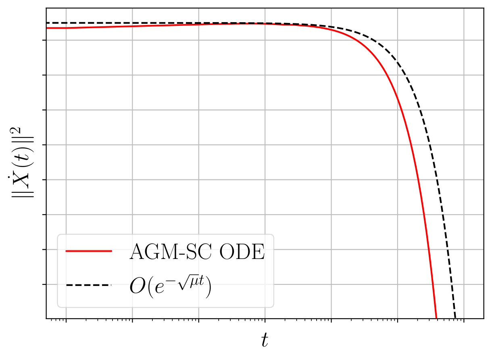

# Continuous-PEP
This repository includes codes to generate the figures presented in the paper "Convergence analysis of ODE models for accelerated first-order methods via positive semidefinite kernels" [(Kim & Yang, 2023)][kim2023].

## Results

### pep_kernel.py.py
Figure 1: Visualization of the PEP kernel for AGM-SC ODE (contour plot, surface plot).

### velocity_experiment.py
Figure 2 in the appendix: Performance of AGM-SC ODE for reducing the squared velocity norm.

[kim2023]: https://proceedings.neurips.cc/paper_files/paper/2023/file/c70741145c2c4f1d0c2e91b98729a49a-Paper-Conference.pdf

# 
